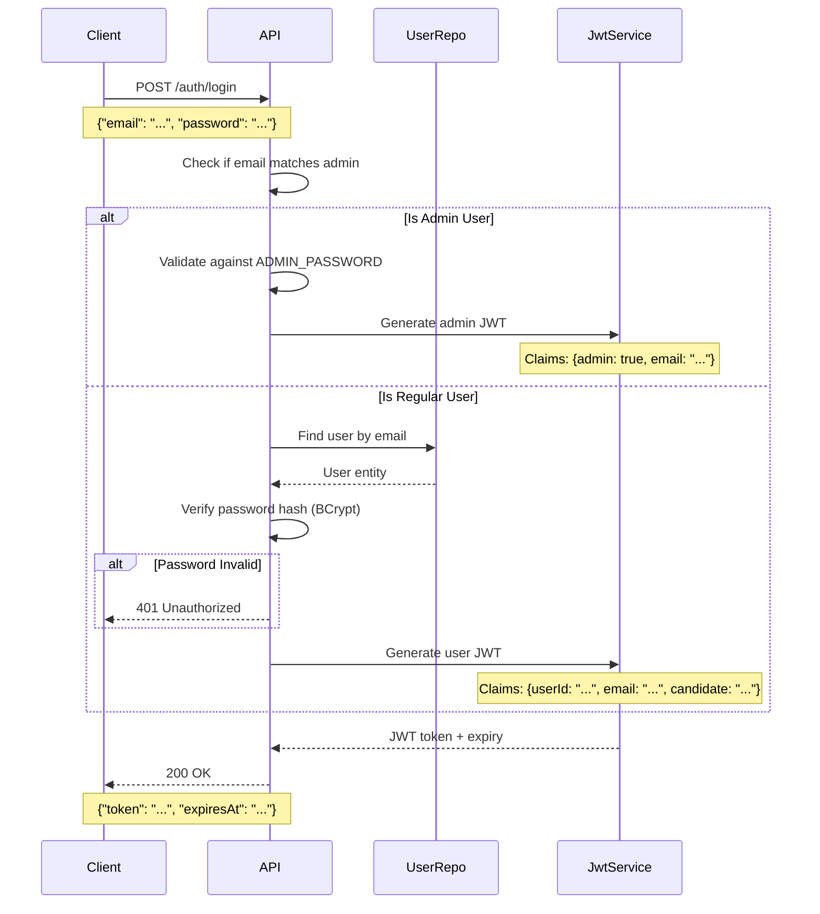
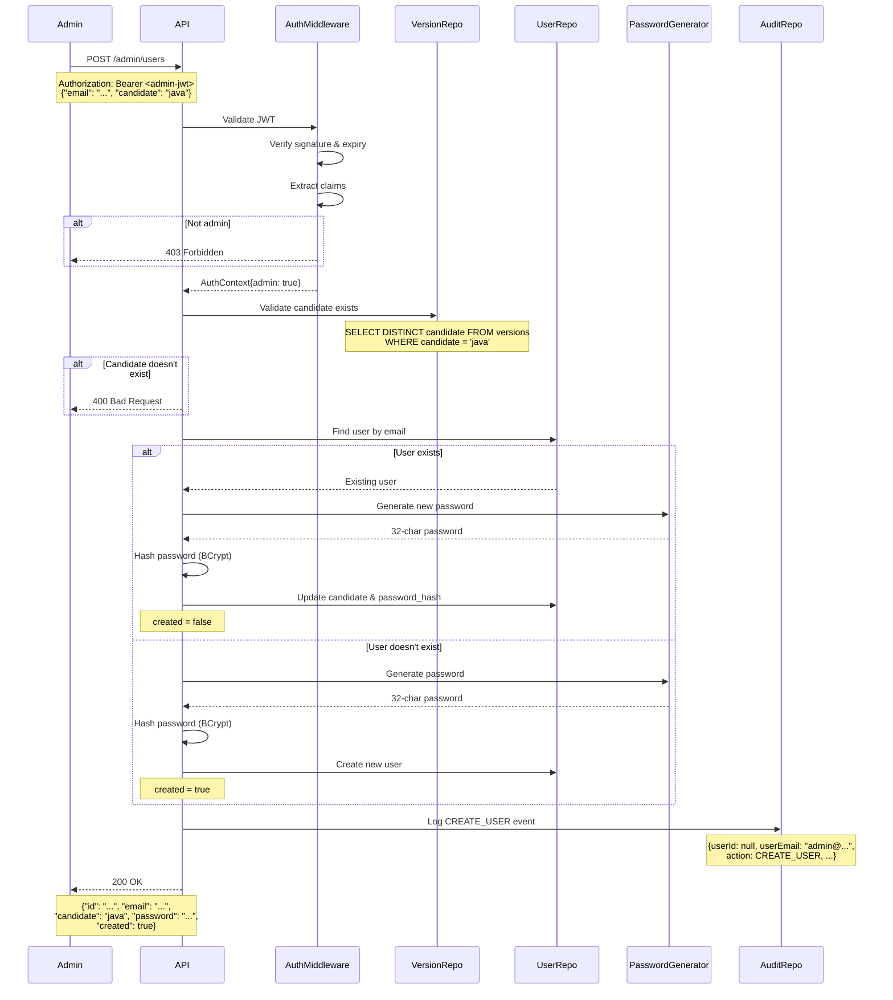
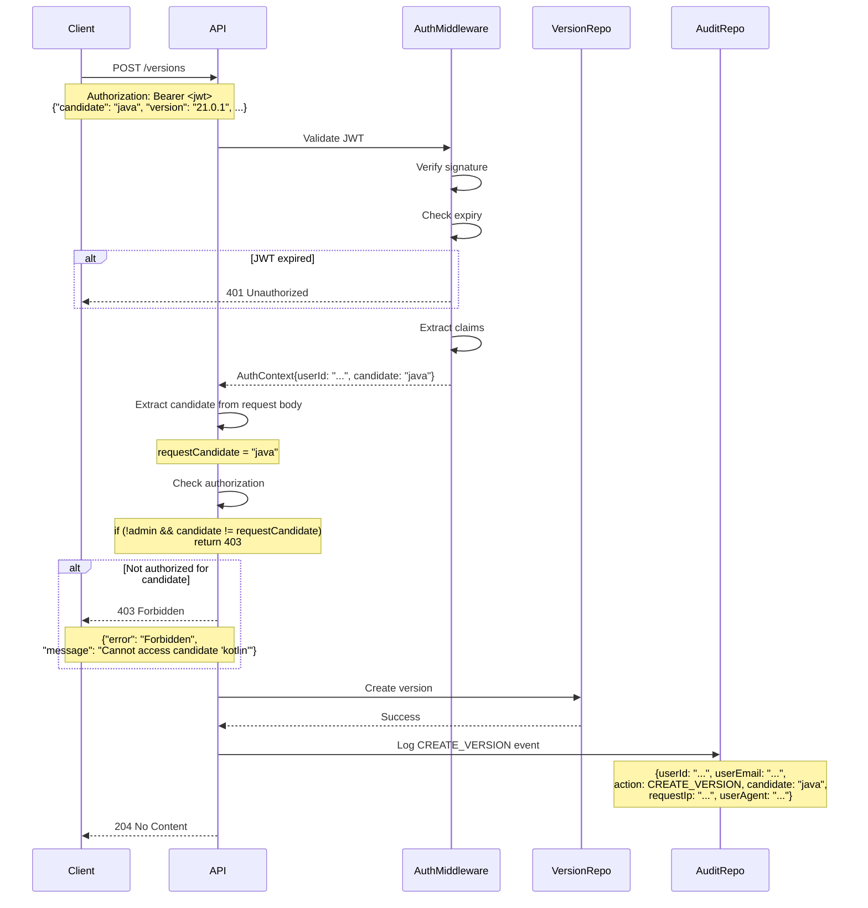

# JWT Authentication System Specification

## Overview

Replace HTTP Basic Authentication with JWT-based authentication for SDKMAN State API write operations. The system provides candidate-scoped authorization for regular users and unrestricted access for the in-memory admin user.

**Key Requirements:**
- In-memory admin user (not persisted to database)
- Database-backed candidate-scoped users
- 1-hour JWT token expiry (no refresh tokens)
- Generated passwords for security
- Vendor audit trail with user attribution
- Clean migration (remove Basic Auth entirely)

## Security Domain Model

### Domain Entities

```kotlin
package io.sdkman.domain.security

import arrow.core.Option
import kotlinx.serialization.Serializable
import java.time.Instant
import java.util.UUID

/**
 * Represents an authenticated user in the system.
 * Users can be either in-memory (admin) or persisted (candidate-scoped).
 */
sealed class User {
    abstract val email: String
    abstract val candidate: Option<String>
    abstract val isAdmin: Boolean

    /**
     * In-memory admin user loaded from environment variables.
     * Has unrestricted access to all candidates.
     */
    data class Admin(
        override val email: String,
        val passwordHash: String
    ) : User() {
        override val candidate: Option<String> = Option.None
        override val isAdmin: Boolean = true
    }

    /**
     * Persisted user with candidate-scoped permissions.
     * Can only perform operations on their assigned candidate.
     */
    data class Publisher(
        val id: UUID,
        override val email: String,
        val passwordHash: String,
        override val candidate: Option<String>,
        val createdAt: Instant,
        val active: Boolean
    ) : User() {
        override val isAdmin: Boolean = false
    }
}

/**
 * Credentials provided during login.
 */
@Serializable
data class LoginRequest(
    val email: String,
    val password: String
)

/**
 * JWT token response after successful authentication.
 */
@Serializable
data class LoginResponse(
    val token: String,
    val expiresAt: String  // ISO-8601 timestamp
)

/**
 * JWT token claims.
 */
data class JwtClaims(
    val userId: Option<UUID>,  // None for admin
    val email: String,
    val candidate: Option<String>,  // None for admin
    val admin: Boolean,
    val issuedAt: Instant,
    val expiresAt: Instant
)

/**
 * Request to create or update a user.
 */
@Serializable
data class CreateUserRequest(
    val email: String,
    val candidate: String
)

/**
 * Response containing user details and generated password.
 */
@Serializable
data class CreateUserResponse(
    val id: String,
    val email: String,
    val candidate: String,
    val password: String,
    val created: Boolean  // true if new, false if updated
)

/**
 * Audit event for tracking API operations.
 */
data class VendorAuditEvent(
    val userId: Option<UUID>,  // None for admin
    val userEmail: String,
    val action: AuditAction,
    val candidate: String,
    val version: String,
    val platform: Option<String>,
    val vendor: Option<String>,
    val requestIp: Option<String>,
    val userAgent: Option<String>,
    val timestamp: Instant
)

/**
 * Types of audited actions.
 */
enum class AuditAction {
    CREATE_VERSION,
    DELETE_VERSION,
    CREATE_USER,
    DELETE_USER,
    RESET_PASSWORD
}

/**
 * Authorization context extracted from JWT.
 */
data class AuthContext(
    val userId: Option<UUID>,
    val email: String,
    val candidate: Option<String>,
    val isAdmin: Boolean
) {
    /**
     * Check if this context can access the given candidate.
     */
    fun canAccessCandidate(targetCandidate: String): Boolean =
        isAdmin || candidate.exists { it == targetCandidate }
}
```

### Value Objects

```kotlin
package io.sdkman.domain.security

/**
 * Securely generated password.
 */
@JvmInline
value class GeneratedPassword(val value: String) {
    init {
        require(value.length == 32) { "Generated password must be 32 characters" }
        require(value.all { it.isLetterOrDigit() }) { "Password must be alphanumeric" }
    }
}

/**
 * Hashed password using BCrypt.
 */
@JvmInline
value class PasswordHash(val value: String) {
    init {
        require(value.startsWith("\$2a\$") || value.startsWith("\$2b\$")) {
            "Password hash must be valid BCrypt format"
        }
    }
}

/**
 * JWT secret key.
 */
@JvmInline
value class JwtSecret(val value: String) {
    init {
        require(value.length >= 32) { "JWT secret must be at least 32 characters" }
    }
}
```

## Database Schema

### Users Table

```sql
CREATE TABLE users (
    id UUID PRIMARY KEY DEFAULT gen_random_uuid(),
    email VARCHAR(255) UNIQUE NOT NULL,
    password_hash VARCHAR(255) NOT NULL,
    candidate VARCHAR(100) NOT NULL,
    created_at TIMESTAMP NOT NULL DEFAULT NOW(),
    active BOOLEAN NOT NULL DEFAULT TRUE
);

CREATE INDEX idx_users_email ON users(email);
CREATE INDEX idx_users_candidate ON users(candidate);
CREATE INDEX idx_users_active ON users(active);
```

### Vendor Audit Table

```sql
CREATE TABLE vendor_audit (
    id BIGSERIAL PRIMARY KEY,
    user_id UUID,  -- NULL for admin user
    user_email VARCHAR(255) NOT NULL,
    action VARCHAR(50) NOT NULL,
    candidate VARCHAR(100) NOT NULL,
    version VARCHAR(100) NOT NULL,
    platform VARCHAR(50),
    vendor VARCHAR(100),
    request_ip VARCHAR(45),  -- IPv6 max length
    user_agent TEXT,
    timestamp TIMESTAMP NOT NULL DEFAULT NOW()
);

CREATE INDEX idx_vendor_audit_user_id ON vendor_audit(user_id);
CREATE INDEX idx_vendor_audit_timestamp ON vendor_audit(timestamp);
CREATE INDEX idx_vendor_audit_candidate ON vendor_audit(candidate);
CREATE INDEX idx_vendor_audit_action ON vendor_audit(action);
```

## API Endpoints

### Authentication Endpoints

#### POST /auth/login

Authenticate user and receive JWT token.

**Request:**
```json
{
  "email": "java-team@sdkman.io",
  "password": "Xk9mP2vR8qL5wN3hT7yJ1cF6bG4sA0zQ"
}
```

**Response (200 OK):**
```json
{
  "token": "eyJhbGciOiJIUzI1NiIsInR5cCI6IkpXVCJ9...",
  "expiresAt": "2025-12-16T13:00:00Z"
}
```

**Error Responses:**
- `401 Unauthorized` - Invalid credentials
- `400 Bad Request` - Malformed request

**JWT Claims:**
```json
{
  "sub": "550e8400-e29b-41d4-a716-446655440000",
  "email": "java-team@sdkman.io",
  "candidate": "java",
  "admin": false,
  "iat": 1734350400,
  "exp": 1734354000,
  "iss": "sdkman-state",
  "aud": "sdkman-api"
}
```

**Admin JWT Claims:**
```json
{
  "email": "marco@sdkman.io",
  "admin": true,
  "iat": 1734350400,
  "exp": 1734354000,
  "iss": "sdkman-state",
  "aud": "sdkman-api"
}
```

### Admin User Management Endpoints

All endpoints require `Authorization: Bearer <jwt-token>` header with admin JWT.

#### POST /admin/users

Create new user or update existing user (idempotent).

**Request:**
```json
{
  "email": "java-team@sdkman.io",
  "candidate": "java"
}
```

**Response (200 OK):**
```json
{
  "id": "550e8400-e29b-41d4-a716-446655440000",
  "email": "java-team@sdkman.io",
  "candidate": "java",
  "password": "Xk9mP2vR8qL5wN3hT7yJ1cF6bG4sA0zQ",
  "created": true
}
```

**Behavior:**
- Validates candidate exists (queries `SELECT DISTINCT candidate FROM versions`)
- If user exists: updates candidate and regenerates password
- If user doesn't exist: creates new user with generated password
- Password is 32-character alphanumeric string (SecureRandom)
- Logs `CREATE_USER` action to vendor_audit table

**Error Responses:**
- `401 Unauthorized` - Missing or invalid JWT
- `403 Forbidden` - Non-admin user
- `400 Bad Request` - Invalid candidate or malformed request

#### DELETE /admin/users/{id}

Soft delete user (sets active=false).

**Response (204 No Content):**
Empty body on success.

**Error Responses:**
- `401 Unauthorized` - Missing or invalid JWT
- `403 Forbidden` - Non-admin user
- `404 Not Found` - User doesn't exist

**Behavior:**
- Sets `active = false` (soft delete)
- Logs `DELETE_USER` action to vendor_audit table
- User can no longer authenticate

#### POST /admin/users/{id}/reset-password

Reset user password.

**Response (200 OK):**
```json
{
  "password": "Nq7tY2kL9vX4bM8wR1hP5cJ3sF6gA0zD"
}
```

**Error Responses:**
- `401 Unauthorized` - Missing or invalid JWT
- `403 Forbidden` - Non-admin user
- `404 Not Found` - User doesn't exist

**Behavior:**
- Generates new 32-character password
- Updates password_hash in database
- Logs `RESET_PASSWORD` action to vendor_audit table

### Protected Endpoints

#### POST /versions

**Authorization:**
- Requires `Authorization: Bearer <jwt-token>` header
- User must have access to candidate specified in request body
- Admin can access all candidates

**Request:**
```json
{
  "candidate": "java",
  "version": "21.0.1",
  "platform": "LINUX_64",
  "url": "https://example.com/java-21.0.1.zip",
  "vendor": "oracle",
  "visible": true
}
```

**Authorization Logic:**
1. Extract JWT claims
2. If `admin == true`: allow
3. If `candidate in JWT != candidate in request`: return 403 Forbidden
4. Otherwise: allow

**Audit Trail:**
- Logs `CREATE_VERSION` to vendor_audit table with user context

#### DELETE /versions

**Authorization:**
Same as POST /versions

**Audit Trail:**
- Logs `DELETE_VERSION` to vendor_audit table with user context

## Authentication Flows

### User Login Flow



### Create User Flow



### Authorized API Request Flow



## Authorization Rules

### Endpoint Access Matrix

| Endpoint | Anonymous | Regular User | Admin |
|----------|-----------|--------------|-------|
| GET /versions/* | ✅ | ✅ | ✅ |
| GET /meta/health | ✅ | ✅ | ✅ |
| POST /auth/login | ✅ | ✅ | ✅ |
| POST /versions | ❌ | ✅ (scoped) | ✅ |
| DELETE /versions | ❌ | ✅ (scoped) | ✅ |
| POST /admin/users | ❌ | ❌ | ✅ |
| DELETE /admin/users/{id} | ❌ | ❌ | ✅ |
| POST /admin/users/{id}/reset-password | ❌ | ❌ | ✅ |

### Candidate Scope Rules

```kotlin
fun authorizeVersionOperation(
    authContext: AuthContext,
    requestCandidate: String
): Either<AuthorizationError, Unit> = either {
    when {
        authContext.isAdmin -> Unit  // Admin bypasses all checks
        authContext.candidate.exists { it == requestCandidate } -> Unit
        else -> raise(AuthorizationError.InsufficientPermissions(
            "User scoped to ${authContext.candidate.getOrElse { "none" }}, " +
            "cannot access candidate '$requestCandidate'"
        ))
    }
}
```

## Configuration

### Environment Variables

| Variable | Required | Default | Description |
|----------|----------|---------|-------------|
| `ADMIN_EMAIL` | Yes | - | In-memory admin user email |
| `ADMIN_PASSWORD` | Yes | - | In-memory admin user password |
| `JWT_SECRET` | Yes | - | Secret key for JWT signing (min 32 chars) |
| `JWT_EXPIRY_HOURS` | No | `1` | JWT token expiry in hours |

### application.conf Changes

Remove existing Basic Auth configuration:

```diff
- api {
-     username = "testuser"
-     username = ${?BASIC_AUTH_USERNAME}
-     password = "password123"
-     password = ${?BASIC_AUTH_PASSWORD}
-     cache.control = 600
- }

+ security {
+     admin.email = ${?ADMIN_EMAIL}
+     admin.password = ${?ADMIN_PASSWORD}
+     jwt.secret = ${?JWT_SECRET}
+     jwt.expiry.hours = 1
+     jwt.expiry.hours = ${?JWT_EXPIRY_HOURS}
+ }
+
+ api {
+     cache.control = 600
+ }
```

## Migration Guide

### Pre-Migration

1. Create admin credentials
2. Set environment variables: `ADMIN_EMAIL`, `ADMIN_PASSWORD`, `JWT_SECRET`
3. Deploy new version with JWT auth
4. Test admin login via `/auth/login`

### User Migration Steps

For each existing Basic Auth consumer:

1. Admin calls `POST /admin/users` with user email and candidate
2. Admin securely shares generated password with user
3. User updates GitHub Actions secrets:
   - Keep: `SDKMAN_API_USERNAME` (now email)
   - Update: `SDKMAN_API_PASSWORD` (new generated password)
4. User updates workflow to add login step:

```yaml
- name: Authenticate
  id: auth
  run: |
    TOKEN=$(curl -X POST ${{ secrets.SDKMAN_API_URL }}/auth/login \
      -H "Content-Type: application/json" \
      -d '{"email":"${{ secrets.SDKMAN_API_USERNAME }}","password":"${{ secrets.SDKMAN_API_PASSWORD }}"}' \
      | jq -r '.token')
    echo "::add-mask::$TOKEN"
    echo "TOKEN=$TOKEN" >> $GITHUB_OUTPUT

- name: Create version
  run: |
    curl -X POST ${{ secrets.SDKMAN_API_URL }}/versions \
      -H "Authorization: Bearer ${{ steps.auth.outputs.TOKEN }}" \
      -H "Content-Type: application/json" \
      -d '...'
```

### Post-Migration

1. Verify all consumers migrated successfully
2. Remove Basic Auth plugin from Application.kt
3. Monitor vendor_audit table for attribution

## Security Considerations

### Password Security
- Passwords generated using `java.security.SecureRandom`
- 32 characters (alphanumeric) = ~190 bits entropy
- Hashed using BCrypt with work factor 12
- Passwords never logged or stored in plaintext

### JWT Security
- HMAC-SHA256 (HS256) algorithm
- Secret key minimum 32 characters (stored in environment)
- Short expiry (1 hour) limits token reuse window
- No refresh tokens prevents long-lived credential theft

### Network Security
- All authentication must occur over HTTPS
- JWT tokens transmitted in Authorization header (not URL)
- Admin password never transmitted except during login

### Audit Trail
- All write operations logged with user attribution
- Includes request IP and user agent for forensics
- Immutable append-only audit log

### Rate Limiting (Future Consideration)
- Consider adding rate limiting to `/auth/login`
- Prevents brute force password attacks
- Example: 5 attempts per IP per minute

## Implementation Notes

### Libraries Required

Add to `build.gradle.kts`:

```kotlin
dependencies {
    // JWT
    implementation("io.ktor:ktor-server-auth-jwt:$ktor_version")
    implementation("com.auth0:java-jwt:4.4.0")

    // Password hashing
    implementation("org.mindrot:jbcrypt:0.4")

    // Existing dependencies...
}
```

### Ktor Plugin Configuration

```kotlin
fun Application.configureJwtAuthentication(config: SecurityConfig) {
    install(Authentication) {
        jwt("jwt-auth") {
            realm = "SDKMAN State API"
            verifier(
                JWT.require(Algorithm.HMAC256(config.jwtSecret.value))
                    .withIssuer("sdkman-state")
                    .withAudience("sdkman-api")
                    .build()
            )
            validate { credential ->
                val email = credential.payload.getClaim("email").asString()
                val admin = credential.payload.getClaim("admin").asBoolean() ?: false
                val candidateClaim = credential.payload.getClaim("candidate").asString()
                val userIdClaim = credential.payload.getClaim("sub").asString()

                if (email != null) {
                    JWTPrincipal(credential.payload)
                } else {
                    null
                }
            }
        }
    }
}
```

### Request IP & User Agent Extraction

```kotlin
fun ApplicationCall.extractRequestMetadata(): RequestMetadata {
    val ip = request.headers["X-Forwarded-For"]?.split(",")?.firstOrNull()?.trim()
        ?: request.local.remoteHost
    val userAgent = request.headers["User-Agent"]

    return RequestMetadata(
        ip = ip.toOption(),
        userAgent = userAgent.toOption()
    )
}
```

### Password Generation

```kotlin
object PasswordGenerator {
    private val secureRandom = java.security.SecureRandom()
    private val chars = ('a'..'z') + ('A'..'Z') + ('0'..'9')

    fun generate(): GeneratedPassword {
        val password = (1..32)
            .map { chars[secureRandom.nextInt(chars.size)] }
            .joinToString("")
        return GeneratedPassword(password)
    }
}
```

## Testing Strategy

### Unit Tests
- Password generation (entropy, format)
- JWT creation and validation
- Authorization logic for candidate scoping
- BCrypt password hashing and verification

### Integration Tests
- Login flow (admin and regular users)
- User creation (new and update scenarios)
- Protected endpoint access with valid/invalid JWTs
- Candidate scope enforcement
- Audit trail creation

### Security Tests
- Expired token rejection
- Invalid signature rejection
- Candidate scope bypass attempts
- SQL injection in user creation
- XSS in audit logs

## Open Questions

None - specification is complete.
