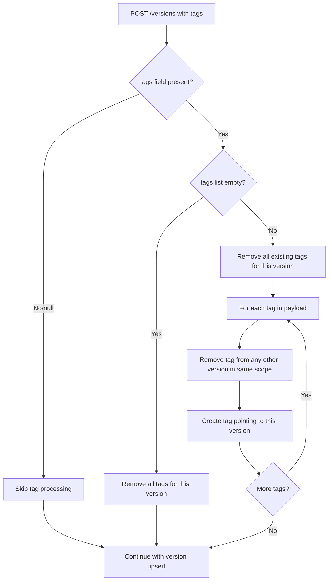
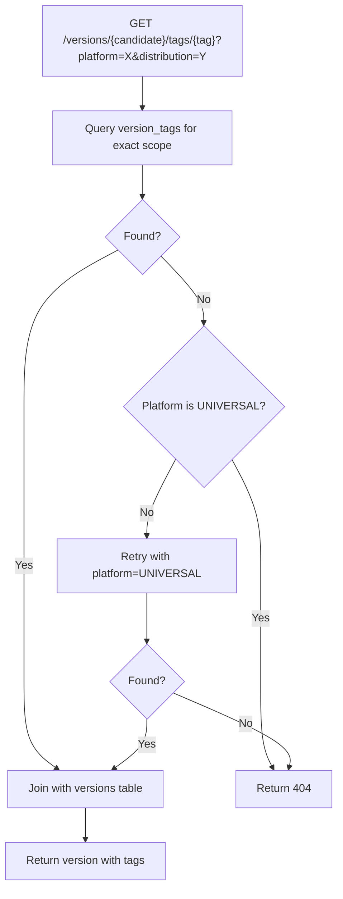
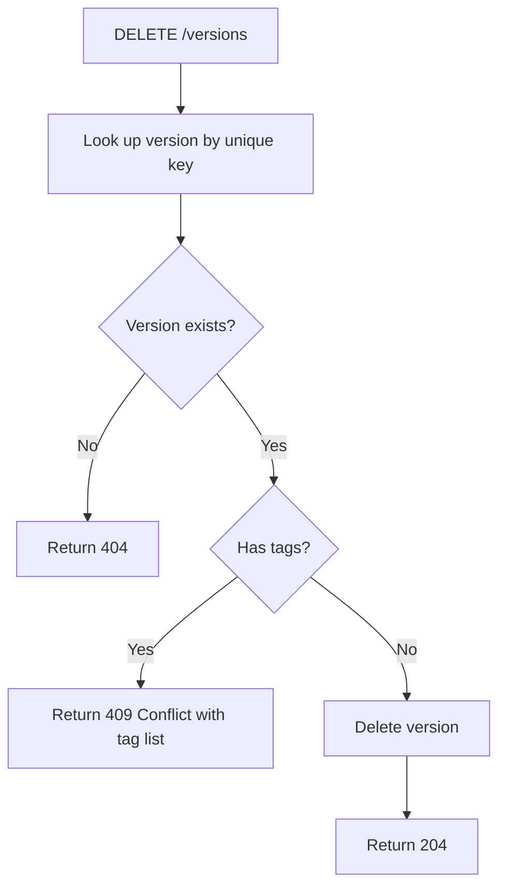

# Version Tagging Specification

## Overview

Introduce a tagging system for SDKMAN versions, inspired by Docker's tagging model. Tags are mutable aliases that point to specific versions within a `(candidate, distribution, platform)` scope. This enables flexible, per-platform rollout of "latest" versions and series-level tracking (e.g., `27` for the latest Java 27.x release).

**Key Requirements:**
- Tags are scoped to `(candidate, distribution, platform)` — each distribution on each platform can have independent tags
- A tag resolves to exactly one version within its scope
- A version can have multiple tags (e.g., `latest`, `27`, `27.1`)
- Tags are mutually exclusive within scope — assigning `latest` to a new version automatically removes it from the old one
- Tags are managed declaratively through the existing `POST /versions` endpoint
- Tagged versions cannot be deleted — tags must be removed or moved first
- Tag resolution falls back from specific platform to `UNIVERSAL` before returning 404

## Use Cases

### Per-Platform Latest Rollout

Java 27.0.2 releases on Linux x64 first, but macOS ARM64 is delayed:

```
POST /versions  {"candidate":"java", "version":"27.0.2", "distribution":"TEMURIN", "platform":"LINUX_X64", "url":"...", "tags":["latest","27","27.0"]}
```

macOS ARM64 remains on 27.0.1 until its build is ready:

```
GET /versions/java/tags/latest?platform=darwinarm64&distribution=TEMURIN
→ returns java 27.0.1 (TEMURIN, MAC_ARM64)
```

A week later, when macOS catches up:

```
POST /versions  {"candidate":"java", "version":"27.0.2", "distribution":"TEMURIN", "platform":"MAC_ARM64", "url":"...", "tags":["latest","27","27.0"]}
```

### Per-Distribution Latest

Corretto and Temurin can have different `latest` versions simultaneously:

```
GET /versions/java/tags/latest?platform=linuxx64&distribution=TEMURIN   → java 27.0.2
GET /versions/java/tags/latest?platform=linuxx64&distribution=CORRETTO  → java 25.0.1
```

### Series Tagging

Track the latest version within a major or minor series:

```
java 27.0.2 (TEMURIN, LINUX_X64)  → tags: ["latest", "27", "27.0"]
java 26.0.5 (TEMURIN, LINUX_X64)  → tags: ["26", "26.0"]
java 27.1.0 (TEMURIN, LINUX_X64)  → tags: ["latest", "27", "27.1"]  ← 27.0 moves off 27.0.2
```

### Universal Platform Candidates

Candidates like Gradle that use `UNIVERSAL` platform have one tag per candidate (no per-platform dimension):

```
POST /versions  {"candidate":"gradle", "version":"8.12", "platform":"UNIVERSAL", "url":"...", "tags":["latest","8","8.12"]}
```

## Domain Model Changes

### Tag as Part of Version Response

Tags are represented as an array of strings on the `Version` entity. When a version has no tags, the field is an empty array.

```kotlin
@Serializable
data class Version(
    val candidate: String,
    val version: String,
    val platform: Platform,
    val url: String,
    val visible: Option<Boolean> = None,
    val distribution: Option<Distribution> = None,
    val md5sum: Option<String> = None,
    val sha256sum: Option<String> = None,
    val sha512sum: Option<String> = None,
    val tags: List<String> = emptyList()
)
```

### Tag Deletion Request

```kotlin
@Serializable
data class UniqueTag(
    val candidate: String,
    val tag: String,
    val distribution: Option<Distribution> = None,
    val platform: Platform
)
```

### Example Version JSON Response

```json
{
  "candidate": "java",
  "version": "27.0.2",
  "distribution": "TEMURIN",
  "platform": "LINUX_X64",
  "url": "https://cdn.example.com/java-27.0.2-temurin-linux-x64.tar.gz",
  "visible": true,
  "tags": ["latest", "27", "27.0"],
  "sha256sum": "abc123..."
}
```

A version without tags:

```json
{
  "candidate": "gradle",
  "version": "8.10",
  "platform": "UNIVERSAL",
  "url": "https://cdn.example.com/gradle-8.10.zip",
  "visible": true,
  "tags": []
}
```

## Database Schema

### New Table: `version_tags`

```sql
CREATE TABLE version_tags (
    id SERIAL PRIMARY KEY,
    candidate TEXT NOT NULL,
    tag TEXT NOT NULL,
    distribution TEXT,
    platform TEXT NOT NULL,
    version_id INTEGER NOT NULL REFERENCES versions(id) ON DELETE RESTRICT,
    created_at TIMESTAMP DEFAULT now(),
    last_updated_at TIMESTAMP DEFAULT now(),
    UNIQUE (candidate, tag, distribution, platform)
);

CREATE INDEX idx_version_tags_version_id ON version_tags(version_id);
CREATE INDEX idx_version_tags_candidate ON version_tags(candidate);
CREATE INDEX idx_version_tags_lookup ON version_tags(candidate, tag, platform);
```

**Design decisions:**

- `UNIQUE (candidate, tag, distribution, platform)` enforces mutual exclusivity — only one version per tag per scope
- `ON DELETE RESTRICT` on `version_id` prevents deleting a version that still has tags pointing to it
- `distribution` is nullable for candidates without distributions (e.g., Gradle)
- The `version_id` foreign key ties tags to the `versions` table, ensuring referential integrity

## API Changes

### Modified: POST /versions (Create/Update Version)

The existing `POST /versions` endpoint accepts an optional `tags` field. Tag management is **declarative** — the tags list in the payload fully replaces any previous tags on that version.

**Request with tags:**
```json
{
  "candidate": "java",
  "version": "27.0.2",
  "distribution": "TEMURIN",
  "platform": "LINUX_X64",
  "url": "https://cdn.example.com/java-27.0.2-temurin-linux-x64.tar.gz",
  "tags": ["latest", "27", "27.0"]
}
```

**Request without tags (no change to existing tags):**
```json
{
  "candidate": "java",
  "version": "27.0.2",
  "distribution": "TEMURIN",
  "platform": "LINUX_X64",
  "url": "https://cdn.example.com/java-27.0.2-temurin-linux-x64.tar.gz"
}
```

**Request with empty tags (removes all tags from version):**
```json
{
  "candidate": "java",
  "version": "27.0.2",
  "distribution": "TEMURIN",
  "platform": "LINUX_X64",
  "url": "https://cdn.example.com/java-27.0.2-temurin-linux-x64.tar.gz",
  "tags": []
}
```

**Response:** `204 No Content` (unchanged)

**Tag processing behaviour on POST:**

1. Look up the version being POSTed by its unique key `(candidate, version, distribution, platform)`
2. If `tags` field is absent/null in the payload: skip all tag processing (leave existing tags untouched)
3. If `tags` field is present (including empty list):
   a. Remove all existing tags for this version in this scope
   b. For each tag in the payload:
      - Remove that tag from any other version in the same `(candidate, distribution, platform)` scope (mutual exclusivity)
      - Create a new tag record pointing to this version
4. Proceed with normal version create/update logic

### Modified: DELETE /versions (Delete Version)

The existing `DELETE /versions` endpoint now checks for tags before deletion.

**New behaviour:**
- If the version has any tags pointing to it, return `409 Conflict` with an error listing the tags that must be removed first
- If no tags exist, proceed with deletion as before

**Error response (409 Conflict):**
```json
{
  "error": "Conflict",
  "message": "Cannot delete version with active tags. Remove or reassign the following tags first.",
  "tags": ["latest", "27", "27.0"]
}
```

### New: GET /versions/{candidate}/tags/{tag}

Resolve a tag to a single version.

**Path parameters:**
- `candidate` — the candidate name (e.g., `java`)
- `tag` — the tag to resolve (e.g., `latest`)

**Query parameters:**
- `platform` (required) — platform ID (e.g., `linuxx64`, `darwinarm64`)
- `distribution` (optional) — distribution name (e.g., `TEMURIN`). Omit for candidates without distributions

**Response (200 OK):**
```json
{
  "candidate": "java",
  "version": "27.0.2",
  "distribution": "TEMURIN",
  "platform": "LINUX_X64",
  "url": "https://cdn.example.com/java-27.0.2-temurin-linux-x64.tar.gz",
  "visible": true,
  "tags": ["latest", "27", "27.0"],
  "sha256sum": "abc123..."
}
```

**Fallback behaviour:**
1. Look up tag in `(candidate, tag, distribution, platform)` scope
2. If not found and platform is not `UNIVERSAL`: retry with `platform = UNIVERSAL`
3. If still not found: return `404 Not Found`

**Error responses:**
- `400 Bad Request` — missing or blank `platform` parameter, blank `candidate` or `tag`
- `404 Not Found` — tag does not exist for the given scope (after fallback attempt)

**Authentication:** None required (public endpoint, same as existing GET endpoints)

### New: DELETE /versions/tags

Remove a tag without moving it to another version.

**Authentication:** Required (same as existing DELETE /versions)

**Request body:**
```json
{
  "candidate": "java",
  "tag": "latest",
  "distribution": "TEMURIN",
  "platform": "LINUX_X64"
}
```

**Response:**
- `204 No Content` — tag successfully removed
- `404 Not Found` — tag does not exist for the given scope
- `400 Bad Request` — validation failures (blank candidate/tag, invalid distribution/platform)
- `401 Unauthorized` — missing or invalid authentication

**Audit:** Records a `DELETE` audit entry for tag removal.

## Tag Processing Flow

### POST /versions with Tags



### Tag Resolution Flow



### Delete Version Flow (Updated)



## Validation Rules

### Tag Name Validation

Applied during `POST /versions` when tags are provided:

- Must not be blank/empty string
- Maximum length: 50 characters
- Allowed characters: alphanumeric, dots (`.`), hyphens (`-`), underscores (`_`)
- Must not start or end with a dot, hyphen, or underscore

**Regex:** `^[a-zA-Z0-9]([a-zA-Z0-9._-]{0,48}[a-zA-Z0-9])?$`

**Validation error response (400 Bad Request):**
```json
{
  "error": "Validation Error",
  "failures": [
    {"field": "tags[0]", "message": "Tag must contain only alphanumeric characters, dots, hyphens, and underscores"},
    {"field": "tags[2]", "message": "Tag must not exceed 50 characters"}
  ]
}
```

### UniqueTag Validation (DELETE /versions/tags)

- `candidate` must not be blank
- `tag` must not be blank
- `platform` must be a valid Platform enum value
- `distribution`, if provided, must be a valid Distribution enum value

## Impact on Existing GET Endpoints

### GET /versions/{candidate}

Existing endpoint returns a list of versions. Each version in the response now includes its `tags` field. No changes to query parameters or filtering logic — tags are purely informational in this context.

### GET /versions/{candidate}/{version}

Existing endpoint returns a single version. The response now includes the `tags` field for that version.

## Audit Trail

Tag operations are captured in the existing audit system:

- **POST /versions with tags:** Audited as part of the normal `CREATE` audit entry. The `version_data` JSONB field will include the `tags` array.
- **DELETE /versions/tags:** Audited as a `DELETE` entry with the tag details in the `version_data` field.

## Authorization

Tag operations follow the same authorization model as existing version operations:

| Endpoint | Anonymous | Regular User | Admin |
|----------|-----------|--------------|-------|
| GET /versions/{candidate}/tags/{tag} | Yes | Yes | Yes |
| POST /versions (with tags) | No | Yes (scoped) | Yes |
| DELETE /versions/tags | No | Yes (scoped) | Yes |

## Testing Strategy

Following the project convention of Kotest `ShouldSpec` integration tests with real PostgreSQL.

### Happy Path Tests

1. **POST version with tags** — create a version with tags, verify tags are stored and returned in GET responses
2. **Tag mutual exclusivity** — POST two versions with the same tag, verify the tag moves to the new version
3. **Tag resolution** — GET /versions/{candidate}/tags/{tag} returns the correct version
4. **Tag resolution with distribution** — verify distribution filtering on tag resolution
5. **Tag fallback to UNIVERSAL** — request a platform-specific tag that doesn't exist, verify fallback to UNIVERSAL
6. **Declarative tag replacement** — POST a version with new tags, verify old tags are removed
7. **Remove all tags with empty array** — POST with `tags: []`, verify all tags removed from version
8. **Tags omitted preserves existing** — POST without `tags` field, verify existing tags unchanged
9. **Delete tag** — DELETE /versions/tags removes the tag
10. **Multiple tags per version** — verify a version can have `latest`, `27`, and `27.0` simultaneously
11. **Tags in version list response** — GET /versions/{candidate} includes tags on each version
12. **Tags in single version response** — GET /versions/{candidate}/{version} includes tags

### Unhappy Path Tests

1. **Delete tagged version blocked** — DELETE /versions returns 409 when version has tags
2. **Tag resolution 404** — resolve a non-existent tag, get 404
3. **Tag resolution 404 after fallback** — non-existent tag with no UNIVERSAL fallback
4. **Invalid tag name** — POST with tag containing invalid characters, get 400
5. **Blank tag name** — POST with empty string in tags array, get 400
6. **Tag name too long** — POST with tag exceeding 50 characters, get 400
7. **Delete non-existent tag** — DELETE /versions/tags for unknown tag, get 404
8. **Tag resolution missing platform** — GET without platform query parameter, get 400
9. **Tag resolution invalid distribution** — GET with non-existent distribution, get 404
10. **Unauthenticated tag deletion** — DELETE /versions/tags without auth, get 401

## Open Questions

None — specification is complete.
